# AbilityEditorHelper

**[中文](#中文) | [English](#english)**

---

# 中文

一个基于 Schema 驱动的 Unreal Engine GAS（Gameplay Ability System）配置自动化插件。让策划能够使用最熟悉的 Excel 表格来配置 GameplayEffect 和 GameplayAbility，并自动同步到编辑器资产。

## 一、背景与动机

大多数 UE 项目都采用了 GAS 插件。以 GameplayEffect（GE）为例，一个中等规模的项目往往需要配置成百上千个效果——治疗、伤害、Buff、Debuff、控制效果……每个 GE 都需要配置持续时间、堆叠策略、多个属性修改器、Tags 等大量参数，GameplayAbility（GA）同理。

目前 GE 的主流配置方法有以下几种：

1. **直接使用 GE**，在 GE 的蓝图资产里进行配置
2. **通过 DT 进行配置**，在编辑器环境下，通过 DT 的数据去创建和修改 GE 的参数
3. **通过 Excel 进行配置**，导表工具生成对应的 Json 数据文件，运行时通过 SetByCaller、AddAssetTags 等手段，通过 Spec 去动态赋值

但以上方式或多或少存在以下痛点：

| 痛点 | 说明 |
|------|------|
| 手动配置繁琐 | 需逐个创建 GE/GA 蓝图资产，为每个资产手动配置十几到几十个参数，无法批量修改，维护困难 |
| 团队协作困难 | DT、GE 等蓝图资产很难进行团队协作 |
| 动态赋值有限 | EffectSpec 功能有限，很多 GameplayEffectComponent 不支持动态赋值，导表方案仍离不开蓝图配置 |

**AbilityEditorHelper** 的解决方案：策划在 Excel 中配置数据 → 导表工具转为 JSON → 导入 DataTable → 依据 DataTable 在编辑器下自动创建和更新 GE/GA 资产。

## 二、插件概述

AbilityEditorHelper 是一个基于 Schema（数据说明）驱动的 Unreal Engine GAS 配置自动化工具。它的核心理念很简单：让策划能够使用他们最熟悉的 Excel 表格来配置 GameplayEffect 和 GameplayAbility。

这个插件提供了一套完整的自动化工作流：

```
┌──────────────────┐
│  C++ 结构体定义    │  程序员维护
│FGameplayEffectConfig│
└────────┬─────────┘
         │ ① 通过 UE 反射系统
         ↓
┌──────────────────┐
│   JSON Schema    │  自动生成
│ *.schema.json    │
└────────┬─────────┘
         │ ② Python 读取 Schema
         ↓
┌──────────────────┐
│   Excel 模板      │  自动生成（带下拉列表和提示）
│ *.xlsx           │
└────────┬─────────┘
         │ ③ 策划填写配置
         ↓
┌──────────────────┐
│  填写完的 Excel   │  配置数据
│ *.xlsx           │
└────────┬─────────┘
         │ ④ Python 基于 Schema 解析
         ↓
┌──────────────────┐
│    JSON 数据      │  标准格式（兼容 UE DataTable）
│ *.json           │
└────────┬─────────┘
         │ ⑤ C++ 反序列化并导入 DataTable
         ↓
┌──────────────────┐
│  UE GE/GA 资产   │  最终产物
│ *.uasset         │
└──────────────────┘
```

## 三、快速开始

项目中所有需要配置的数据，都在 `Editor Settings -> Ability Editor Helper Settings` 下，之后不额外进行说明。

### 1. 配置项目环境

项目依赖 Unreal Python 环境，请进行以下配置：

1. **启用插件**：在 `Edit -> Plugins` 中搜索并启用：
   - **Python Editor Script Plugin**：提供 Python 脚本支持
   - **Editor Scripting Utilities**：提供编辑器操作 API
2. **启用开发模式（推荐）**：在 `Project Settings -> Plugins -> Python` 中勾选 `Enable Python Developer Mode`
3. **安装 Python 依赖**：
   - **openpyxl**（核心依赖）：`pip install openpyxl`，用于读写 `.xlsx` 文件
   - **ptvsd**（可选）：`pip install ptvsd`，用于远程调试 Python 脚本

> 若未安装 `openpyxl`，插件会自动降级使用 CSV 格式。

### 2. 导出 UE 结构体的 Schema 文件

Schema 文件（`.schema.json`）可以理解为 UE 结构体的说明书，它的作用是作为编辑器和编辑器外数据沟通转化的桥梁。可以在 `Plugins/AbilityEditorHelper/Content/Python/Schema` 目录下查看示例项目导出的 Schema 文件。

以 `FAbilityTriggerConfig` 这个结构体为例：

```cpp
USTRUCT(BlueprintType)
struct FAbilityTriggerConfig
{
    GENERATED_BODY()

    // 触发 Tag
    UPROPERTY(EditAnywhere, BlueprintReadWrite, Category = "Trigger")
    FGameplayTag TriggerTag;

    // 触发来源
    UPROPERTY(EditAnywhere, BlueprintReadWrite, Category = "Trigger")
    TEnumAsByte<EGameplayAbilityTriggerSource::Type> TriggerSource = EGameplayAbilityTriggerSource::GameplayEvent;
};
```

由它导出的 Schema 文件长这样：

```json
{
    "structPath": "/Script/AbilityEditorHelper.AbilityTriggerConfig",
    "hash": "76ba80183347a22e16a52b06c85c8c21",
    "fields": [
        {
            "name": "TriggerTag",
            "kind": "struct",
            "structPath": "/Script/GameplayTags.GameplayTag",
            "excelHint": "",
            "excelSheet": ""
        },
        {
            "name": "TriggerSource",
            "kind": "enum",
            "enumValues": ["GameplayEvent", "OwnedTagAdded", "OwnedTagPresent"],
            "excelHint": "",
            "excelSheet": ""
        }
    ]
}
```

插件默认配置导出的结构体数据如下，用户可以在配置的 Schema 里自行添加修改。

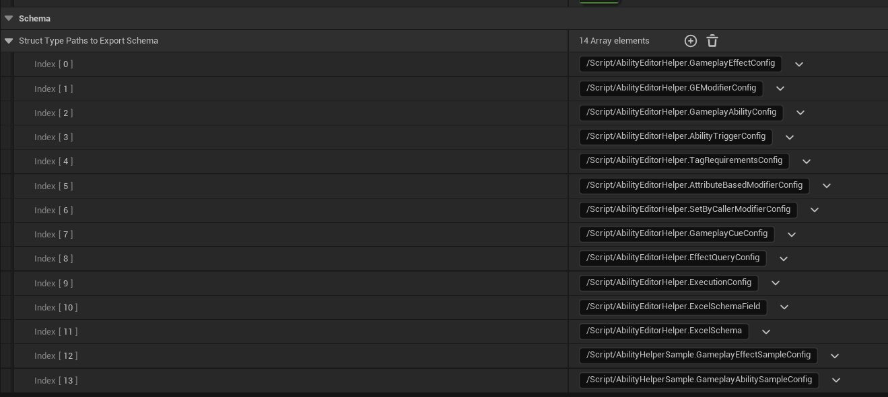

**导出 Schema 文件的函数**：`UAbilityEditorHelperLibrary::GenerateAllSchemasFromSettings`，导出的路径需要进行配置，可在配置里的 SchemaPath 里修改。


执行函数后，就可以看到在指定文件夹下导出的结果了：

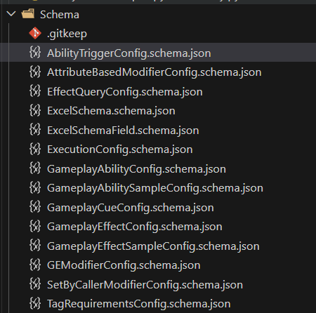

### 3. 生成 Excel 模板

有了 Schema 文件后，插件就可以依据它们去创建 Excel 模板了。

**调用函数**：`AbilityEditorHelperPythonLibrary::GenerateExcelTemplateFromSchema`

**参数**：
- `StructTypeName`：Excel 导出依赖的结构体类型
- `Excel File Name`：创建的 Excel 文件名，生成路径可在设置里的 ExcelPath 进行配置
- `PreServeData`：为 `true` 时保留原有数据

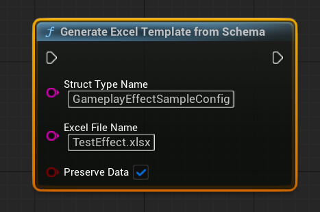

导出后的结果如下，第一行为属性名，第二行为属性的配置说明：

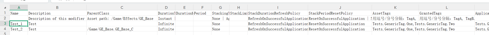

### 4. 在 Excel 中填写数据

有了 Excel 以后，就可以填写数据了。对于枚举变量，是支持下拉配置的。

> **注意**：枚举变量必须要填写，否则后面导出数据的时候会报错。

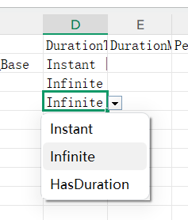

### 5. Excel 数据导出

有了数据以后，就可以尝试着将数据导出了。

**调用函数**：`AbilityEditorHelperPythonLibrary::ExportExcelToJsonUsingSchema`，可以将 Excel 导出为 Json 格式的数据文件。

**参数**：
- `ExcelFileName`：作为数据源的 Excel 文件名
- `JsonFileName`：导出的 Json 文件名，路径可在设置里的 JsonPath 进行配置
- `StructTypeName`：数据依赖的 UE 结构体名

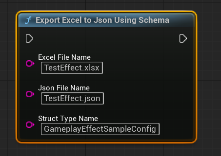

导出的数据格式与 UE DataTable 导出格式一致，可直接被 UE 读取导入。

### 6. 将 Json 数据导入到 DataTable 中

**调用函数**：`UAbilityEditorHelperLibrary::ImportAndUpdateGameplayAbilitiesFromJson` 进行导入。

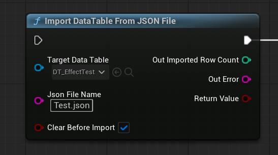

导入后的数据：

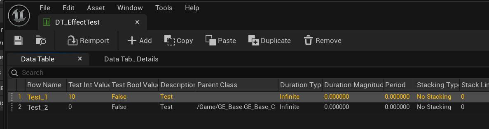

### 7. 依据 DT 创建和更新 GE

**调用函数**：`UAbilityEditorHelperLibrary::CreateOrUpdateGameplayEffectsFromSettings`，可以依据配置的 DT，去创建和更新 GameplayEffect。

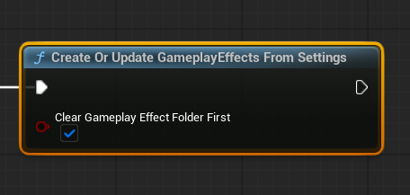

依赖的数据源 DT，配置在 `GameplayEffectDataTable`，`GameplayEffectClass` 为创建的 GE 的基类，`GameplayEffectPath` 为 GE 生成的路径。

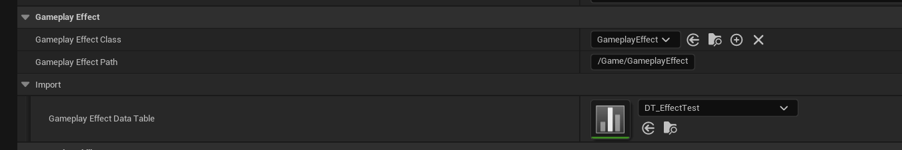

创建后的结果如下：

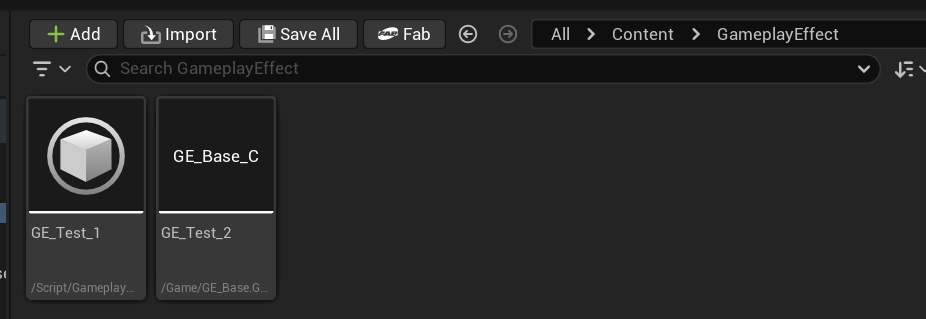

可以看到数据被正确的写入到对应的 GameplayEffect 里了。

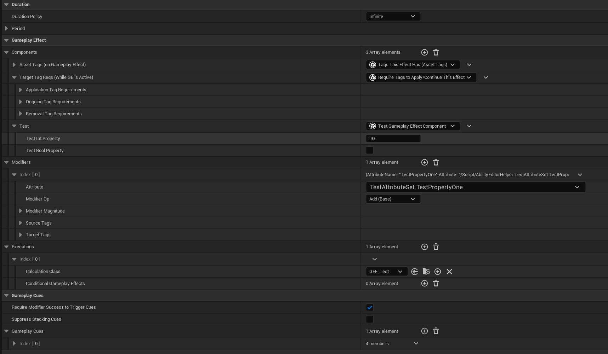

## 四、插件功能说明

### UI 操作界面

在 `Window -> Ability Editor Helper Widget` 处，可打开可视化的操作界面。

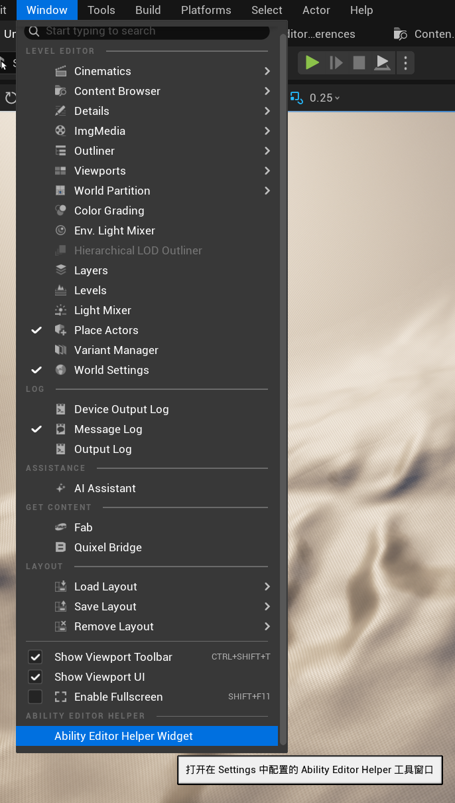

| 按钮 | 功能 |
|------|------|
| **GenerateAllSchemas** | 在 Settings 配置的目标路径，生成项目结构体的 Schema 文件 |
| **GE/GA Excel Template** | 在 Settings 配置的目标路径，生成 Excel 模板文件 |
| **GE/GA Excel Import** | 在 Settings 配置的目标路径，基于 Excel 数据，生成 Json 数据 |
| **Gen/Update GE/GA** | 在 Settings 配置的目标路径，生成或更新 GameplayEffects/GameplayAbilities |

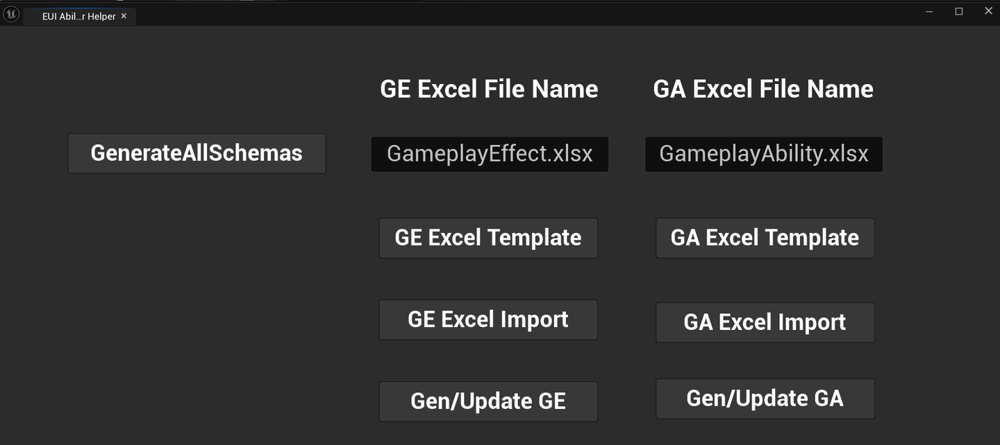

### 如何扩展导入导出的功能

考虑到项目内部都会扩展 GameplayEffect 的功能，比如新增数据，或者新增 GameplayEffectComponent，因此插件自带的导出导入数据和代码可能无法完成需求。插件也考虑到了扩展的需求。

相关代码可在 `Source/AbilityHelperSample/DevTest` 中进行参考。

#### 1. 派生数据结构体

以 GE 为例，可在项目代码中派生 `FGameplayEffectConfig` 类（DT 的数据结构体），然后在里面新增数据。`ExcelSheet` 可以让新增数据导出到 Excel 模板里有专门的子表，而不影响到原有的别的数据。

```cpp
USTRUCT(BlueprintType)
struct ABILITYHELPERSAMPLE_API FGameplayEffectSampleConfig : public FGameplayEffectConfig
{
    GENERATED_BODY()

    /** 测试用整数属性，将写入 TestGameplayEffectComponent */
    UPROPERTY(EditAnywhere, BlueprintReadWrite, Category = "SampleExtension",
       meta = (ExcelHint = "测试整数值", ExcelSheet = "SampleExtension"))
    int32 TestIntValue = 0;

    /** 测试用布尔属性，将写入 TestGameplayEffectComponent */
    UPROPERTY(EditAnywhere, BlueprintReadWrite, Category = "SampleExtension",
       meta = (ExcelHint = "测试布尔值", ExcelSheet = "SampleExtension"))
    bool bTestBoolValue = false;
};
```

导出的 Excel 模板如下：

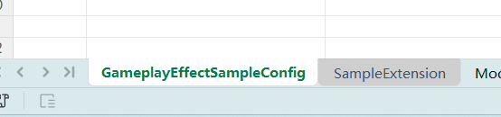

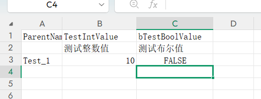

#### 2. 通过委托处理扩展数据

插件代码在创建和更新 GE 时都会通过委托进行广播，因此可以在项目代码里监听这个委托，然后依据数据对 GE 进行处理。

```cpp
// 获取 AbilityEditorHelperSubsystem 并绑定委托
if (GEditor)
{
    if (UAbilityEditorHelperSubsystem* HelperSubsystem = GEditor->GetEditorSubsystem<UAbilityEditorHelperSubsystem>())
    {
        // 绑定 GE 委托
        PostProcessGEDelegateHandle = HelperSubsystem->OnPostProcessGameplayEffect.AddUObject(
            this, &UAbilityHelperSampleSubsystem::HandlePostProcessGameplayEffect);
    }
}
```

项目扩展数据处理示例代码：

```cpp
void UAbilityHelperSampleSubsystem::HandlePostProcessGameplayEffect(
    const FTableRowBase* Config, UGameplayEffect* GE)
{
    if (!Config || !GE) return;

    const FGameplayEffectSampleConfig* SampleConfig = static_cast<const FGameplayEffectSampleConfig*>(Config);

    bool bHasExtensionData = (SampleConfig->TestIntValue != 0) || SampleConfig->bTestBoolValue;

    if (bHasExtensionData)
    {
        UTestGameplayEffectComponent& TestComp = GE->FindOrAddComponent<UTestGameplayEffectComponent>();
        TestComp.TestIntProperty = SampleConfig->TestIntValue;
        TestComp.bTestBoolProperty = SampleConfig->bTestBoolValue;
    }
    else
    {
        RemoveGEComponent<UTestGameplayEffectComponent>(GE);
    }
}
```

在创建的 GE 里，可以看到项目自己的 TestGameplayEffectComponent 被成功的添加进了 GE，并正确的写入了数据：

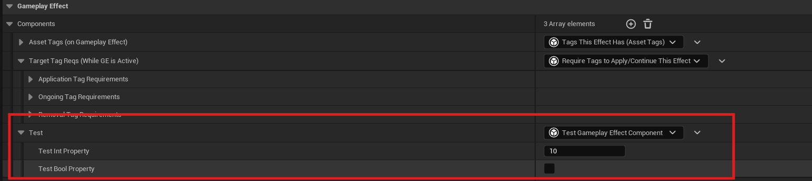

## 五、一些功能的原理解析

### 在导入数据时，如何判断资产是否被修改

依据 DT 创建和更新 UE 资产时，我们需要对资产 Mark Dirty 并保存，那么如何判断一个 GE 或者 GA 是否被修改了呢？

一种很容易想到的简单方法是，在 `CreateOrImportGameplayEffect` 函数内部，对所有数据在写入前进行比较，如果变化了，则设置 `bDirty` 为 true。但这个方法需要对每个数据都进行比较，新增数据也需要额外的代码进行处理，不是一种好方法。

这里提供一种更好的思路：**利用 UE 序列化的函数，去判断资产是否发生修改**。将 GE 及其子对象（包括 GE Components）序列化为字节数组，如果 GE 内的数据未发生改变，那么序列化的结果肯定是一致的。

将数据写入前的序列化结果，和写入后的进行比较，只对不一致的 MarkDirty 并保存。

```cpp
static TArray<uint8> SerializeObjectState(UObject* Obj)
{
    TArray<uint8> Bytes;
    FGEStateWriter Ar(Bytes);
    Obj->Serialize(Ar);

    // 同时序列化所有子对象（GE Components 等），以捕获组件属性变更
    TArray<UObject*> SubObjects;
    GetObjectsWithOuter(Obj, SubObjects, false);
    SubObjects.Sort([](const UObject& A, const UObject& B)
    {
        return A.GetName() < B.GetName();
    });
    for (UObject* SubObj : SubObjects)
    {
        SubObj->Serialize(Ar);
    }
    return Bytes;
}
```

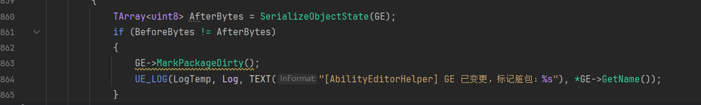

### 对于一些私有数据，有什么办法访问并修改

UE 的类里，有很多数据，比如 GA 的 `AbilityTags`，是 protected，在一般情况下是禁止在类外直接访问并修改的。当然想要访问它有很多的方法，比如最简单的通过 public 函数进行访问，但是写插件的时候，肯定是不希望改动和影响到源码的。

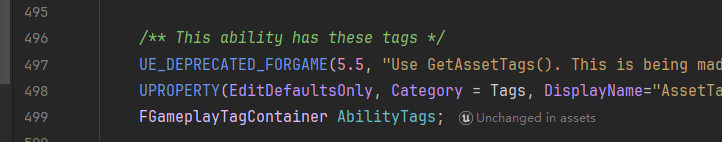

那么，有没有什么方法，可以简单的绕过私有限制呢？

当然是有的，以 `AbilityTags` 为例，看到上面的 `UPROPERTY` 吗，它意味着我们可以利用 UE 的反射系统去访问它！

```cpp
auto SetTagContainerProperty = [&](const TCHAR* PropertyName, const FGameplayTagContainer& Tags)
{
    if (FStructProperty* Prop = CastField<FStructProperty>(GAClass->FindPropertyByName(PropertyName)))
    {
        FGameplayTagContainer* ValuePtr = Prop->ContainerPtrToValuePtr<FGameplayTagContainer>(GA);
        if (ValuePtr)
        {
            *ValuePtr = Tags;
        }
    }
};

SetTagContainerProperty(TEXT("AbilityTags"), Config.AbilityTags);
```

UE 项目的脚本 lua、python 等也是利用反射系统去访问和修改属性的，这也导致了有时候一些私有属性也可以被脚本瞎改，还很难搜到，这也是甜蜜的烦恼了。

### 自定义 UPROPERTY Meta

UE 有一个功能可能很少有人用到，那就是我们可以自定义的 UPROPERTY meta。例如下面的 Attribute 属性，我们定义了一个 meta `ExcelHint`，它可以通过 `GetMetaData` 函数去进行访问。这样子我们就可以在编辑器环境下，赋予属性一些额外的说明。

```cpp
UPROPERTY(EditAnywhere, BlueprintReadWrite, Category = "Modifier",
    meta = (ExcelHint = "Format: ClassName.PropertyName (e.g. TestAttributeSet.TestPropertyOne)"))
FString Attribute;
```

```cpp
Field.ExcelHint = Prop->GetMetaData(TEXT("ExcelHint"));
```

比如 `ExcelHint`、`ExcelSeparator`、`ExcelSheet`、`ExcelIgnore` 等 meta 数据本身对 UE 引擎没有意义，但它们会被 Schema 导出系统提取到 JSON 中，然后被 Python Excel 工具读取。这实际上是把 UPROPERTY meta 当作一种跨语言的声明式协议——C++ 端声明数据的 Excel 表现方式，Python 端消费这些声明来生成模板和做数据转换。

| Meta 标签 | 说明 |
|-----------|------|
| `ExcelHint` | Excel 提示行显示的自定义说明文字 |
| `ExcelSeparator` | 数组字段在单元格内的分隔符（如 `\|` 或 `,`） |
| `ExcelSheet` | 指定字段所属的子表名称 |
| `ExcelIgnore` | 标记为忽略，不导出到 Excel |

## 项目结构

```
AbilityHelperSample/
├── docs/
│   └── PULL_REQUEST_GUIDE.md             # PR 工作流指南（中/英文）
├── Plugins/
│   └── AbilityEditorHelper/              # 核心插件
│       ├── Content/Python/               # Python 脚本（Excel 生成/导出）
│       │   └── Schema/                   # 导出的 Schema 示例
│       └── Resources/                    # 插件资源
├── Source/
│   └── AbilityHelperSample/
│       └── DevTest/                      # 扩展示例代码
└── Resources/                            # 文档截图
```

## Pull Request 工作流

关于 Copilot PR（拉取请求）的完整说明——包括什么是 PR、为什么使用 PR、如何审查/合并/回滚，以及本次 DataTable-to-asset 自动同步 PR 的推荐流程，请参阅：

👉 [docs/PULL_REQUEST_GUIDE.md](docs/PULL_REQUEST_GUIDE.md)

## 许可证

本项目采用 MIT 许可证。

---

# English

A Schema-driven automation plugin for Unreal Engine's Gameplay Ability System (GAS). It enables designers to configure GameplayEffects and GameplayAbilities using familiar Excel spreadsheets, with automatic synchronization to editor assets.

## 1. Background & Motivation

Most UE projects adopt the GAS plugin. Taking GameplayEffect (GE) as an example, a mid-sized project often requires configuring hundreds or even thousands of effects — healing, damage, buffs, debuffs, crowd control, etc. Each GE needs configuration for duration, stacking policies, multiple attribute modifiers, Tags, and much more. The same applies to GameplayAbility (GA).

Current mainstream approaches for GE configuration include:

1. **Direct GE configuration** — configuring parameters directly in GE Blueprint assets
2. **DataTable-based configuration** — creating and modifying GE parameters via DataTable data in the editor
3. **Excel-based configuration** — exporting tables to generate JSON data files, then dynamically assigning values at runtime via SetByCaller, AddAssetTags, and EffectSpec

However, these approaches all have their pain points:

| Pain Point | Description |
|------------|-------------|
| Tedious manual configuration | Must create GE/GA Blueprint assets one by one, manually configure dozens of parameters per asset; no batch editing, difficult to maintain |
| Poor team collaboration | Blueprint assets like DT and GE are difficult for team collaboration |
| Limited dynamic assignment | EffectSpec has limited functionality; many GameplayEffectComponents don't support dynamic assignment, so table-export solutions still can't avoid Blueprint configuration |

**AbilityEditorHelper**'s solution: Designers configure data in Excel → export tool converts to JSON → import into DataTable → automatically create and update GE/GA assets in the editor based on the DataTable.

## 2. Plugin Overview

AbilityEditorHelper is a Schema-driven automation tool for Unreal Engine GAS configuration. Its core concept is simple: let designers use the Excel spreadsheets they're most familiar with to configure GameplayEffects and GameplayAbilities.

The plugin provides a complete automated workflow:

```
┌────────────────────┐
│  C++ Struct Def     │  Maintained by programmers
│FGameplayEffectConfig│
└────────┬───────────┘
         │ ① Via UE Reflection System
         ↓
┌────────────────────┐
│    JSON Schema     │  Auto-generated
│  *.schema.json     │
└────────┬───────────┘
         │ ② Python reads Schema
         ↓
┌────────────────────┐
│   Excel Template   │  Auto-generated (with dropdowns & hints)
│   *.xlsx           │
└────────┬───────────┘
         │ ③ Designers fill in data
         ↓
┌────────────────────┐
│  Completed Excel   │  Configuration data
│  *.xlsx            │
└────────┬───────────┘
         │ ④ Python parses based on Schema
         ↓
┌────────────────────┐
│    JSON Data       │  Standard format (UE DataTable compatible)
│  *.json            │
└────────┬───────────┘
         │ ⑤ C++ deserializes & imports to DataTable
         ↓
┌────────────────────┐
│  UE GE/GA Assets  │  Final output
│  *.uasset          │
└────────────────────┘
```

## 3. Quick Start

All configuration data is located under `Editor Settings -> Ability Editor Helper Settings`.

### Step 1: Setup Project Environment

The project depends on Unreal Python. Please configure as follows:

1. **Enable Plugins**: In `Edit -> Plugins`, search and enable:
   - **Python Editor Script Plugin**: Provides Python scripting support
   - **Editor Scripting Utilities**: Provides editor operation APIs
2. **Enable Developer Mode (Recommended)**: Check `Enable Python Developer Mode` in `Project Settings -> Plugins -> Python`
3. **Install Python Dependencies**:
   - **openpyxl** (Core): `pip install openpyxl` — for reading/writing `.xlsx` files
   - **ptvsd** (Optional): `pip install ptvsd` — for remote debugging Python scripts

> If `openpyxl` is not installed, the plugin will automatically fall back to CSV format.

### Step 2: Export UE Struct Schema Files

Schema files (`.schema.json`) serve as a "specification document" for UE structs, acting as a bridge for data communication between the editor and external data. You can view sample Schema files exported by the example project in the `Plugins/AbilityEditorHelper/Content/Python/Schema` directory.

Taking `FAbilityTriggerConfig` as an example:

```cpp
USTRUCT(BlueprintType)
struct FAbilityTriggerConfig
{
    GENERATED_BODY()

    // Trigger Tag
    UPROPERTY(EditAnywhere, BlueprintReadWrite, Category = "Trigger")
    FGameplayTag TriggerTag;

    // Trigger Source
    UPROPERTY(EditAnywhere, BlueprintReadWrite, Category = "Trigger")
    TEnumAsByte<EGameplayAbilityTriggerSource::Type> TriggerSource = EGameplayAbilityTriggerSource::GameplayEvent;
};
```

The exported Schema file looks like this:

```json
{
    "structPath": "/Script/AbilityEditorHelper.AbilityTriggerConfig",
    "hash": "76ba80183347a22e16a52b06c85c8c21",
    "fields": [
        {
            "name": "TriggerTag",
            "kind": "struct",
            "structPath": "/Script/GameplayTags.GameplayTag",
            "excelHint": "",
            "excelSheet": ""
        },
        {
            "name": "TriggerSource",
            "kind": "enum",
            "enumValues": ["GameplayEvent", "OwnedTagAdded", "OwnedTagPresent"],
            "excelHint": "",
            "excelSheet": ""
        }
    ]
}
```

The plugin's default struct export configuration is shown below. Users can add or modify structs in the Schema settings.


**Export function**: `UAbilityEditorHelperLibrary::GenerateAllSchemasFromSettings`. The export path can be configured via SchemaPath in settings.


After execution, you can see the exported results in the specified folder:


### Step 3: Generate Excel Templates

Once you have Schema files, the plugin can create Excel templates based on them.

**Function**: `AbilityEditorHelperPythonLibrary::GenerateExcelTemplateFromSchema`

**Parameters**:
- `StructTypeName`: The struct type that the Excel export depends on
- `Excel File Name`: The name of the Excel file to create; the generation path can be configured via ExcelPath in settings
- `PreServeData`: When set to `true`, preserves existing data


The exported result: Row 1 contains property names, Row 2 contains property configuration hints:


### Step 4: Fill in Data in Excel

Once you have the Excel template, you can start filling in data. Enum fields support dropdown selection.

> **Note**: Enum fields must be filled in; otherwise, an error will occur during data export.


### Step 5: Export Excel Data

Once you have data, you can export it.

**Function**: `AbilityEditorHelperPythonLibrary::ExportExcelToJsonUsingSchema` — exports Excel to JSON format data files.

**Parameters**:
- `ExcelFileName`: The source Excel file name
- `JsonFileName`: The exported JSON file name; path can be configured via JsonPath in settings
- `StructTypeName`: The UE struct name that the data depends on


The exported data format is compatible with UE DataTable export format and can be directly read and imported by UE.

### Step 6: Import JSON Data into DataTable

**Function**: `UAbilityEditorHelperLibrary::ImportAndUpdateGameplayAbilitiesFromJson`


Imported data:


### Step 7: Create and Update GE Based on DataTable

**Function**: `UAbilityEditorHelperLibrary::CreateOrUpdateGameplayEffectsFromSettings` — creates and updates GameplayEffects based on the configured DataTable.


The data source DT is configured in `GameplayEffectDataTable`, `GameplayEffectClass` is the base class for created GEs, and `GameplayEffectPath` is the generation path for GE assets.


The created results:


You can see the data has been correctly written to the corresponding GameplayEffect.


## 4. Plugin Features

### UI Operation Panel

Open the visual operation panel at `Window -> Ability Editor Helper Widget`.


| Button | Function |
|--------|----------|
| **GenerateAllSchemas** | Generate struct Schema files at the configured target path |
| **GE/GA Excel Template** | Generate Excel template files at the configured target path |
| **GE/GA Excel Import** | Generate JSON data from Excel data at the configured target path |
| **Gen/Update GE/GA** | Create or update GameplayEffects/GameplayAbilities at the configured target path |


### How to Extend Import/Export Functionality

Since projects typically extend GameplayEffect functionality (e.g., adding new data or new GameplayEffectComponents), the plugin's built-in export/import data and code may not meet all requirements. The plugin has been designed with extensibility in mind.

Reference code can be found in `Source/AbilityHelperSample/DevTest`.

#### 1. Derive Data Structs

Taking GE as an example, you can derive from `FGameplayEffectConfig` (the DT data struct) in your project code and add new data fields. `ExcelSheet` allows new data to be exported to a dedicated sub-sheet in the Excel template without affecting existing data.

```cpp
USTRUCT(BlueprintType)
struct ABILITYHELPERSAMPLE_API FGameplayEffectSampleConfig : public FGameplayEffectConfig
{
    GENERATED_BODY()

    /** Test integer property, written to TestGameplayEffectComponent */
    UPROPERTY(EditAnywhere, BlueprintReadWrite, Category = "SampleExtension",
       meta = (ExcelHint = "Test integer value", ExcelSheet = "SampleExtension"))
    int32 TestIntValue = 0;

    /** Test boolean property, written to TestGameplayEffectComponent */
    UPROPERTY(EditAnywhere, BlueprintReadWrite, Category = "SampleExtension",
       meta = (ExcelHint = "Test boolean value", ExcelSheet = "SampleExtension"))
    bool bTestBoolValue = false;
};
```

The exported Excel template:


#### 2. Handle Extension Data via Delegates

The plugin broadcasts delegates when creating and updating GEs, so project code can listen to these delegates and process GEs based on the data.

```cpp
// Get AbilityEditorHelperSubsystem and bind delegate
if (GEditor)
{
    if (UAbilityEditorHelperSubsystem* HelperSubsystem = GEditor->GetEditorSubsystem<UAbilityEditorHelperSubsystem>())
    {
        // Bind GE delegate
        PostProcessGEDelegateHandle = HelperSubsystem->OnPostProcessGameplayEffect.AddUObject(
            this, &UAbilityHelperSampleSubsystem::HandlePostProcessGameplayEffect);
    }
}
```

Extension data processing example:

```cpp
void UAbilityHelperSampleSubsystem::HandlePostProcessGameplayEffect(
    const FTableRowBase* Config, UGameplayEffect* GE)
{
    if (!Config || !GE) return;

    const FGameplayEffectSampleConfig* SampleConfig = static_cast<const FGameplayEffectSampleConfig*>(Config);

    bool bHasExtensionData = (SampleConfig->TestIntValue != 0) || SampleConfig->bTestBoolValue;

    if (bHasExtensionData)
    {
        UTestGameplayEffectComponent& TestComp = GE->FindOrAddComponent<UTestGameplayEffectComponent>();
        TestComp.TestIntProperty = SampleConfig->TestIntValue;
        TestComp.bTestBoolProperty = SampleConfig->bTestBoolValue;
    }
    else
    {
        RemoveGEComponent<UTestGameplayEffectComponent>(GE);
    }
}
```

In the created GE, you can see the project's own TestGameplayEffectComponent has been successfully added with correct data:


## 5. Technical Principles

### How to Detect Asset Modifications During Import

When creating and updating UE assets based on DataTable, we need to Mark Dirty and save assets. But how do we determine whether a GE or GA has been modified?

A simple approach would be to compare all data before writing in the `CreateOrImportGameplayEffect` function, setting `bDirty` to true if anything changed. However, this requires comparing every data field, and new data also needs additional handling — not an ideal solution.

A better approach: **use UE serialization functions to detect asset modifications**. Serialize the GE and its sub-objects (including GE Components) into a byte array. If the data in the GE hasn't changed, the serialization results will be identical.

Compare the serialization results before and after data writing; only MarkDirty and save those that differ.

```cpp
static TArray<uint8> SerializeObjectState(UObject* Obj)
{
    TArray<uint8> Bytes;
    FGEStateWriter Ar(Bytes);
    Obj->Serialize(Ar);

    // Also serialize all sub-objects (GE Components, etc.) to capture component property changes
    TArray<UObject*> SubObjects;
    GetObjectsWithOuter(Obj, SubObjects, false);
    SubObjects.Sort([](const UObject& A, const UObject& B)
    {
        return A.GetName() < B.GetName();
    });
    for (UObject* SubObj : SubObjects)
    {
        SubObj->Serialize(Ar);
    }
    return Bytes;
}
```


### Accessing and Modifying Private Data

Many data members in UE classes, such as GA's `AbilityTags`, are protected and normally cannot be directly accessed or modified from outside the class. While there are many ways to access them (e.g., through public functions), when writing plugins, we don't want to modify or affect the engine source code.


Is there a way to simply bypass private access restrictions?

Yes! Taking `AbilityTags` as an example — notice the `UPROPERTY` macro above it? This means we can use UE's reflection system to access it!

```cpp
auto SetTagContainerProperty = [&](const TCHAR* PropertyName, const FGameplayTagContainer& Tags)
{
    if (FStructProperty* Prop = CastField<FStructProperty>(GAClass->FindPropertyByName(PropertyName)))
    {
        FGameplayTagContainer* ValuePtr = Prop->ContainerPtrToValuePtr<FGameplayTagContainer>(GA);
        if (ValuePtr)
        {
            *ValuePtr = Tags;
        }
    }
};

SetTagContainerProperty(TEXT("AbilityTags"), Config.AbilityTags);
```

Scripts in UE projects (Lua, Python, etc.) also use the reflection system to access and modify properties. This means private properties can sometimes be modified by scripts in unexpected ways — a bittersweet convenience.

### Custom UPROPERTY Meta

UE has a rarely used feature: custom UPROPERTY meta tags. For example, for the Attribute property below, we define a meta tag `ExcelHint` that can be accessed via the `GetMetaData` function. This allows us to attach additional descriptions to properties in the editor environment.

```cpp
UPROPERTY(EditAnywhere, BlueprintReadWrite, Category = "Modifier",
    meta = (ExcelHint = "Format: ClassName.PropertyName (e.g. TestAttributeSet.TestPropertyOne)"))
FString Attribute;
```

```cpp
Field.ExcelHint = Prop->GetMetaData(TEXT("ExcelHint"));
```

Meta tags like `ExcelHint`, `ExcelSeparator`, `ExcelSheet`, and `ExcelIgnore` have no meaning to the UE engine itself, but they are extracted into JSON by the Schema export system and then consumed by the Python Excel tool. This effectively uses UPROPERTY meta as a cross-language declarative protocol — C++ declares how data should be represented in Excel, and Python consumes these declarations to generate templates and perform data conversion.

| Meta Tag | Description |
|----------|-------------|
| `ExcelHint` | Custom instruction text displayed in the Excel hint row |
| `ExcelSeparator` | Inline separator for array fields (e.g., `\|` or `,`) |
| `ExcelSheet` | Specifies the sub-sheet name for the field |
| `ExcelIgnore` | Marks the field to be excluded from Excel export |

## Project Structure

```
AbilityHelperSample/
├── docs/
│   └── PULL_REQUEST_GUIDE.md             # PR workflow guide (Chinese/English)
├── Plugins/
│   └── AbilityEditorHelper/              # Core plugin
│       ├── Content/Python/               # Python scripts (Excel generation/export)
│       │   └── Schema/                   # Exported Schema examples
│       └── Resources/                    # Plugin resources
├── Source/
│   └── AbilityHelperSample/
│       └── DevTest/                      # Extension example code
└── Resources/                            # Documentation screenshots
```

## Pull Request Workflow

For a complete explanation of Copilot PRs — what a PR is, why PRs are used, how to review/merge/rollback, and the recommended workflow for this DataTable-to-asset sync PR — see:

👉 [docs/PULL_REQUEST_GUIDE.md](docs/PULL_REQUEST_GUIDE.md)

## License

This project is licensed under the MIT License.
